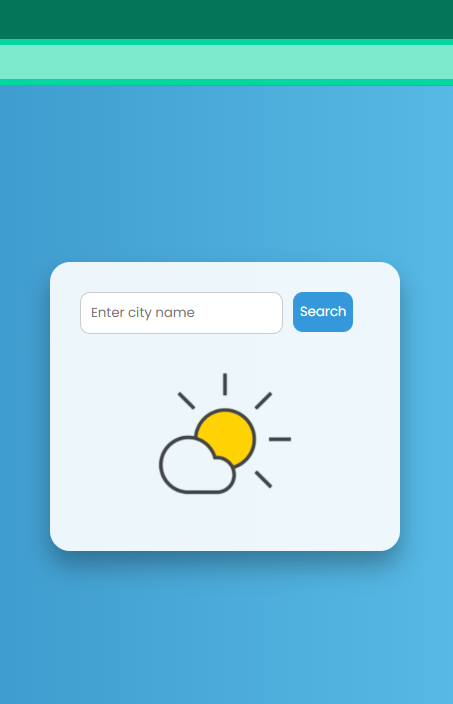
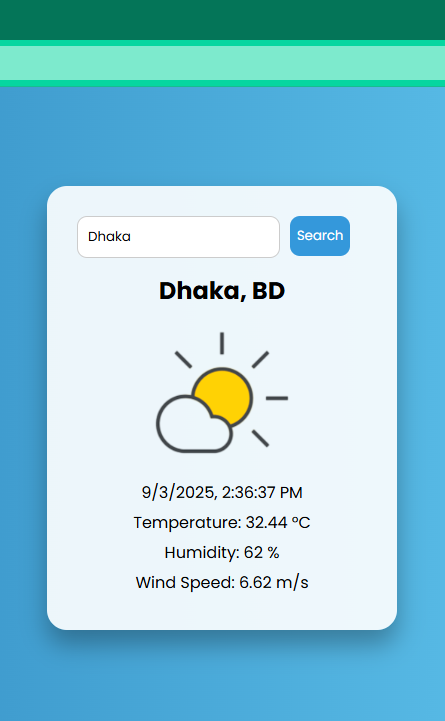

# Weather App 🌤️

A simple and responsive **Weather App** built with **HTML, CSS, and JavaScript**.  
It fetches real-time weather data using the **OpenWeather API** and displays:

## 🚀 Demo

Live demo: [click here](https://weather-shifat.netlify.app/)
 
or, 
 
link: https://weather-shifat.netlify.app

- 🌡️ Temperature (°C)  
- 💧 Humidity  
- 🌬️ Wind Speed  
- 📅 Date & Time

## 📸 Screenshots
 

---

## 🚀 Features
- Search weather by city name.  
- User-friendly and professional UI/UX.  
- Responsive design (works on desktop & mobile).  

## 🛠️ Tech Stack
- **HTML5**  
- **CSS3**  
- **JavaScript (ES6)**  
- **OpenWeather API**  

## 🔑 Setup & Usage

1. Clone the repository
2. Open index.html in your browser.
3. Add your OpenWeather API key in script.js
4. Enter a city name in the search bar to get real-time weather updates.

## 📝 License
- [MIT License](LICENSE)
